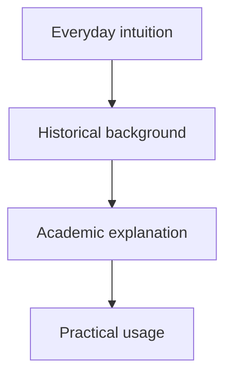

# Content Generation Guidelines for Learning Materials

These guidelines are intended for LLM-based agents creating learning materials in Markdown documents, Jupyter notebooks, Google Colab notebooks, or similar teaching resources.

The materials are primarily for bachelor-level computer science students, master’s-level digital humanities students, adult learners, and interested general readers. The goal is to produce content that starts from accessible intuition and gradually develops into academically grounded explanation.

## Core Output Requirement

Generated material should be ready to paste directly into a larger Markdown document or notebook.

Because the generated section will usually be inserted under a larger document title:

- Use a **second-level heading** (`##`) for the main topic title.
- Use **third-level headings** (`###`) for major subtopics.
- Do **not** use a first-level heading (`#`) inside generated topic material.
- Use standard Markdown formatting consistently.
- Prefer clarity, precision, and pedagogical usefulness over decorative style.

## Reusable Prompt Template

Use the following prompt when asking an LLM-based agent to generate topic material.

```markdown
You are creating learning material for bachelor-level students, primarily in computer science, with some materials also useful for master's students in digital humanities, adult learners, and interested general readers.

Your output will be inserted into a larger Markdown document or notebook. Therefore:

- Use a **second-level heading** (`##`) for the main topic title.
- Use **third-level headings** (`###`) for all major subtopics.
- Do **not** use a first-level heading (`#`), because that is reserved for the full document or notebook title.
- Use standard Markdown formatting clearly and consistently.
- Use lists, tables, code blocks, links, image links, diagrams, and examples where appropriate.
- Keep the tone accessible but academically responsible.
- Avoid unexplained jargon. When technical terms are necessary, define them.
- Prefer concrete examples before abstraction.
- When giving code examples, keep them short, correct, and directly connected to the concept.
- When citing sources, include proper references or links in a short “References” subsection.
- Do not invent references. If uncertain about a source, say so or omit it.
- The material should be suitable for inclusion in teaching notes, lecture notebooks, or self-study resources.

The topic to explain is:

**[INSERT TOPIC HERE]**

Generate the material using the following structure.

## [Topic Title]

Write the topic title as a second-level Markdown heading.

Begin with a short orientation paragraph explaining why this topic matters and where it appears in practice.

### 1. Everyday Explanation

Explain the concept in ordinary everyday language.

The goal of this section is that a motivated non-specialist should understand the basic idea.

Requirements:

- Use simple language.
- Avoid formal definitions at first.
- Use one or two everyday analogies.
- Explain the problem or need that motivates the topic.
- Make clear what the concept is useful for.
- Do not assume prior university-level knowledge.

Recommended pattern:

- “Imagine that...”
- “The main idea is...”
- “This matters because...”

### 2. Historical Background and Development of the Idea

Briefly explain how the topic developed.

This section should show that the concept did not appear out of nowhere, but grew from earlier problems, ideas, technologies, or theories.

Requirements:

- Keep the section concise but meaningful.
- Mention important earlier ideas, people, technologies, or mathematical foundations when relevant.
- Explain what problem previous approaches could not solve well.
- Explain why this topic became important.
- Use a chronological or cause-and-effect structure where possible.
- Avoid excessive historical detail unless it directly helps understanding.

Possible guiding questions:

- What came before this idea?
- What limitations did earlier approaches have?
- What changed technologically, mathematically, or scientifically?
- Why did people need this concept?

### 3. Bachelor-Level Academic Explanation

Now explain the topic at a more rigorous bachelor-level standard.

This section should be suitable for computer science, digital humanities, or technically oriented university students.

Requirements:

- Provide a clear definition.
- Introduce important terminology.
- Explain the core mechanism, model, algorithm, framework, or theory.
- Use formal notation, pseudocode, equations, diagrams, or code examples when useful.
- Explain assumptions and limitations.
- Distinguish the topic from related concepts.
- Include at least one concrete worked example.
- When relevant, discuss computational complexity, data requirements, interpretability, reliability, or ethical issues.
- Include references to textbooks, papers, documentation, or authoritative sources.

Suggested structure:

- Definition
- Core idea
- Main components
- Example
- Limitations
- Related concepts
- References

Use Markdown tables where comparison helps. For example:

| Concept | Meaning | Example |
|---|---|---|
| Term A | Short explanation | Concrete example |
| Term B | Short explanation | Concrete example |

Use code blocks where helpful:

```python
# Short, focused example
```

Use mathematical notation where appropriate:

```markdown
The time complexity is usually written as \(O(n \log n)\).
```

### 4. Practical Meaning, Usage, and Path Forward

End with an accessible takeaway section.

This section should help students understand what they should remember, how they might use the topic, and what to study next.

Requirements:

- Summarize the key idea in plain language.
- Explain where the topic is used in practice.
- Give practical tips for recognizing when the concept applies.
- Mention common mistakes or misconceptions.
- Suggest what to learn next.
- Include a compact checklist or takeaway list.

Recommended subsections:

#### Key Takeaways

Use a short bullet list.

#### When to Use This Idea

Explain practical situations where the topic is useful.

#### Common Mistakes

List frequent misunderstandings or beginner errors.

#### What to Learn Next

Suggest related topics in a sensible learning order.

### 5. References and Further Reading

Include a short list of reliable references.

Requirements:

- Prefer authoritative sources: textbooks, peer-reviewed papers, official documentation, university materials, or reputable technical documentation.
- Use links when available.
- Separate beginner-friendly resources from more advanced resources if useful.
- Do not overload the reader with too many references.
- Use 3–6 good references unless the topic requires more.

Example format:

- Author, *Title*, publisher/year.
- [Official documentation or open textbook title](URL)
- Author, “Paper Title,” venue/year.

### General Style Requirements

Write clearly and pedagogically.

The material should:

- Start simple and become gradually more formal.
- Avoid jumping immediately into formulas or code.
- Use examples before abstractions where possible.
- Explain why the topic matters, not only what it is.
- Be suitable for copying directly into a Markdown file or Jupyter/Colab notebook.
- Avoid motivational fluff.
- Avoid unsupported claims.
- Avoid excessive bullet lists when a short paragraph would explain the idea better.
- Use Markdown headings consistently.
- Use British or American English consistently within the same document.

### Optional Enhancements

Use these only when they genuinely improve the material:

- A small diagram using Mermaid syntax.
- A short comparison table.
- A minimal code example.
- A worked example with step-by-step reasoning.
- A small “Try it yourself” exercise.
- A reflective question for students.
- A warning box using Markdown blockquote syntax.

Example warning format:

> **Common pitfall:** Students often confuse X with Y. The difference is that X ..., while Y ...

### Final Quality Check

Before finishing, verify that:

- The main heading uses `##`, not `#`.
- All subsections use `###` or lower.
- The explanation begins in everyday terms.
- Historical background is present but concise.
- The academic explanation is bachelor-level and technically accurate.
- References are included and plausible.
- The takeaway section is accessible and practical.
- The output is valid Markdown.
```

## Short Operational Prompt

Use this shorter version when repeatedly generating sections and when the context is already clear.

```markdown
Create Markdown learning material for the topic **[INSERT TOPIC]**.

The output will be inserted into a larger notebook or Markdown document, so begin with a second-level heading `## [Topic Title]`. Use third-level headings `###` for subtopics. Do not use a first-level heading.

Audience: bachelor-level computer science students, master’s-level digital humanities students, adult learners, and interested general readers.

Structure the material as follows:

1. `### Everyday Explanation`
   - Explain the concept in ordinary language.
   - Use one or two everyday analogies.
   - Explain why the concept matters.
   - Avoid unexplained jargon.

2. `### Historical Background and Development`
   - Briefly explain what earlier ideas, problems, or technologies led to this topic.
   - Mention important people, theories, or milestones when relevant.
   - Keep it accessible and concise.

3. `### Academic Explanation`
   - Give a bachelor-level explanation.
   - Define the concept precisely.
   - Introduce key terminology.
   - Explain the core mechanism, theory, algorithm, or model.
   - Include examples, formulas, pseudocode, diagrams, tables, or code where useful.
   - Discuss limitations and related concepts.
   - Include proper references.

4. `### Practical Meaning and Usage`
   - Explain how the concept is used in practice.
   - Provide key takeaways.
   - Mention common mistakes.
   - Suggest what to learn next.

5. `### References and Further Reading`
   - Include 3–6 reliable sources.
   - Prefer textbooks, academic papers, official documentation, or reputable open educational resources.
   - Do not invent references.

Use standard Markdown: paragraphs, bullet lists, numbered lists, tables, code blocks, links, image links, and Mermaid diagrams where appropriate. The final result should be clear, accurate, pedagogically useful, and ready to paste into a Markdown document or notebook cell.
```

## Stricter Agent-Oriented Prompt

Use this version when placing instructions in an `AGENTS.md`, repository root context file, or automated content-generation workflow.

```markdown
You are an educational content-generation agent.

Your task is to produce a ready-to-use Markdown section about **[INSERT TOPIC]**.

The section will be inserted into a larger teaching document. Therefore the main topic heading must be a second-level heading:

## [Topic Title]

All internal sections must use third-level headings or lower. Do not use `#`.

The target audience is mixed:
- bachelor-level computer science students;
- master’s-level digital humanities students;
- adult learners with general interest;
- readers who may have uneven mathematical or programming background.

Your explanation must progress through four pedagogical layers:

### Everyday Explanation

Explain the topic in plain language. Begin from intuition, not formalism. Use concrete examples and analogies. Make the reader understand what problem the topic solves.

### Historical Background and Development

Briefly explain how the topic emerged. Mention earlier ideas, limitations, discoveries, technologies, or research traditions that led to it. Keep the explanation accessible and relevant.

### Academic Explanation

Give a rigorous bachelor-level explanation. Define the concept, explain its structure or mechanism, introduce key terminology, and provide a worked example. Use formulas, code, pseudocode, diagrams, tables, or links where they genuinely help. Explain limitations and distinguish the topic from related concepts. Include citations or references to reliable sources.

### Practical Meaning and Usage

Explain what students should remember, where the idea is used, how to recognize situations where it applies, and what mistakes to avoid. End with key takeaways and suggestions for further study.

### References and Further Reading

Provide 3–6 reliable references. Do not fabricate sources. Prefer textbooks, official documentation, peer-reviewed papers, reputable open course materials, or authoritative technical sources.

Formatting rules:

- Use valid Markdown.
- Use tables for comparisons.
- Use fenced code blocks for code.
- Use Mermaid diagrams only when useful.
- Use image links only when they add instructional value.
- Keep examples compact and relevant.
- Avoid unnecessary verbosity.
- Avoid unexplained abbreviations.
- Avoid empty motivational language.
- Make the result directly usable in a Markdown file, Jupyter Notebook, or Google Colab notebook.
```

## Suggested Topic Section Skeleton

Generated topic sections should generally resemble the following structure:

```markdown
## [Topic Title]

Short orientation paragraph explaining why this topic matters.

### Everyday Explanation

Accessible explanation using ordinary language and concrete examples.

### Historical Background and Development

Brief historical and conceptual development of the topic.

### Academic Explanation

Bachelor-level explanation with definitions, terminology, examples, and appropriate formalism.

### Practical Meaning and Usage

Takeaways, usage advice, common mistakes, and suggested next steps.

### References and Further Reading

Reliable references and links.
```

## Markdown Conventions

Use standard Markdown features where they improve readability.

### Headings

```markdown
## Main Topic
### Major Subtopic
#### Smaller Subsection
```

### Lists

Use bullet lists for unordered points:

```markdown
- First point
- Second point
- Third point
```

Use numbered lists for sequences, steps, or ranked processes:

```markdown
1. First step
2. Second step
3. Third step
```

### Tables

Use tables for comparisons, taxonomies, terminology, and trade-offs.

```markdown
| Concept | Meaning | Example |
|---|---|---|
| Accuracy | How often results are correct overall | Correct classifications / all classifications |
| Precision | How often selected results are relevant | True positives / selected positives |
```

### Code Blocks

Use fenced code blocks with language identifiers.

````markdown
```python
def example():
    return "Keep examples short and relevant"
```
````

### Mathematical Notation

Use LaTeX-style notation when supported by the target platform.

```markdown
The running time is often written as \(O(n \log n)\).
```

For longer equations:

```markdown
$$
precision = \frac{true\ positives}{true\ positives + false\ positives}
$$
```

### Mermaid Diagrams

Use Mermaid only when it clarifies structure or process.

````markdown

````

### Blockquotes for Warnings or Notes

```markdown
> **Common pitfall:** Do not confuse the abstract idea with one particular implementation.
```

## Pedagogical Principles

### Move from Intuition to Formalism

Start with an understandable situation, example, or analogy. Only then introduce definitions, notation, algorithms, code, or theory.

### Explain the Problem Before the Solution

Students understand concepts better when they know what problem the concept solves. Avoid presenting topics as isolated definitions.

### Prefer Concrete Examples

A short example is usually more useful than a long abstract paragraph. Examples may include small datasets, simple programs, toy algorithms, diagrams, or realistic scenarios.

### Make Assumptions Explicit

State what the explanation assumes. For example:

- prior programming experience;
- basic algebra;
- familiarity with graphs;
- knowledge of probability;
- experience using spreadsheets or databases.

### Distinguish Similar Ideas

Where confusion is likely, explicitly compare related concepts.

Examples:

- accuracy vs precision;
- recursion vs iteration;
- array vs linked list;
- supervised vs unsupervised learning;
- markup vs programming language;
- data model vs database implementation.

### Include Limitations

A good teaching explanation should say not only when an idea works, but also when it does not work well.

Mention limitations such as:

- computational cost;
- data quality requirements;
- interpretability problems;
- ethical concerns;
- implementation complexity;
- dependency on assumptions.

## Quality Checklist for Generated Material

Before accepting generated material, check the following:

- [ ] The main heading uses `##`.
- [ ] Subtopics use `###` or lower.
- [ ] The explanation starts with everyday intuition.
- [ ] Historical background is included and concise.
- [ ] The academic explanation is rigorous enough for bachelor-level students.
- [ ] Important terminology is defined.
- [ ] At least one concrete example is included.
- [ ] Tables, code, diagrams, or formulas are used only when helpful.
- [ ] Limitations or common misconceptions are mentioned.
- [ ] Practical takeaways are included.
- [ ] References are included when factual or academic claims are made.
- [ ] Sources are not fabricated.
- [ ] The output is valid Markdown.
- [ ] The section can be pasted directly into a notebook or Markdown document.

## Common Problems to Avoid

### Starting Too Formally

Poor pattern:

> A graph is an ordered pair \(G = (V, E)\), where...

Better pattern:

> A graph is a way to describe things and the connections between them. For example, cities can be connected by roads, people can be connected by friendships, and web pages can be connected by links.

Formal notation can appear later, after intuition has been established.

### Giving History Without Pedagogical Purpose

Historical background should help students understand why the concept exists. Avoid biographical detail unless it clarifies the development of the idea.

### Using Code Without Explanation

Code examples should be accompanied by explanation. Do not assume the code speaks for itself.

### Inventing References

If the agent cannot verify a source, it should not invent bibliographic details. It is better to provide fewer reliable references than many questionable ones.

### Overusing Bullet Lists

Bullet lists are useful, but not every explanation should become a list. Use paragraphs for conceptual explanation and lists for summaries, requirements, steps, or contrasts.

## Recommended Final Section Pattern

A strong generated topic section should usually contain:

1. A clear topic heading.
2. A short orientation paragraph.
3. A plain-language explanation.
4. A brief historical development section.
5. A rigorous academic explanation.
6. A worked example.
7. A practical usage section.
8. Common mistakes or misconceptions.
9. Further study suggestions.
10. References.

This structure helps learners move from recognition, to understanding, to application.
